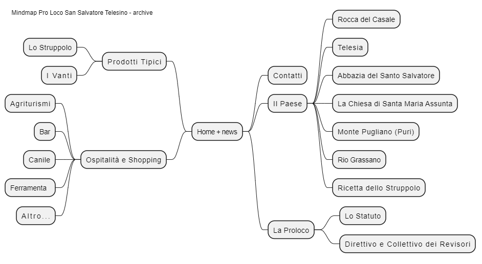

# Mindmap Pro Loco SST

# Trasferire il dominio prolocosansalvatoretelesino.it Recupero Auth-Code

per trasferire il dominio presso un'altro fornitore, occorre l'auth code (chiamato anche authorization code o EPP Code), da richiedere al fornitore (Newshell di Gabriella Cocchiarella http://www.newshell.it). 

L'auth code è un tipo di password, che solo il titolare del nome di dominio è autorizzato a conoscere quindi chi conosce l'auth code è autorizzato a trasferirlo presso un altro gestore.

Se sei l'intestatario del dominio e il tuo fornitore non volesse fornirti l'auth code, nel caso dei domini it puoi contattare il NIC segnalando la problematica all'URL https://www.nic.it/it/contatti .
Nel caso dei domini internazionali, invece, puoi compilare questo modulo http://www.icann.org/en/resources/compliance/complaints/transfer/form in modo che gli enti che sovraintendono alla registrazione dei domini possano prendere opportuni provvedimenti. 
